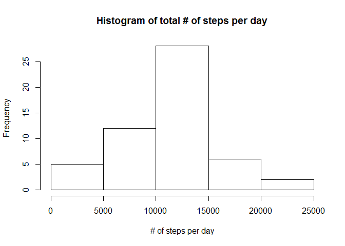
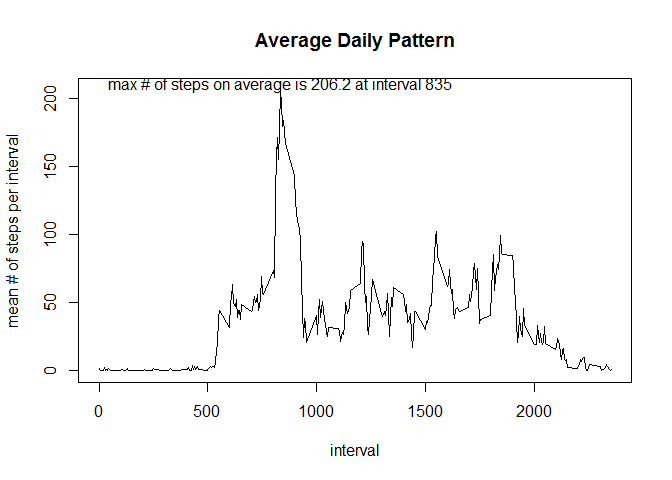
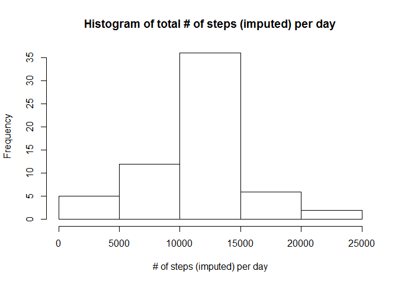
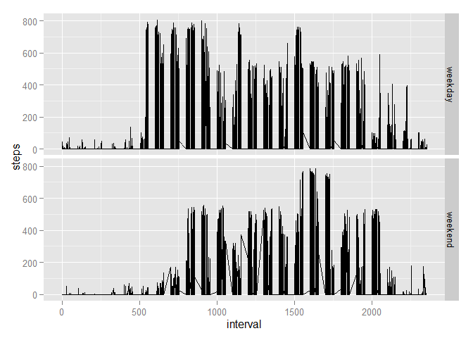

# Reproducible Research: Peer Assessment 1
Eric L  
January 14, 2016  

## 1. Loading and preprocessing the data

### 1.1 Load the data


```r
activity <- read.csv("activity.csv")
head(activity); str(activity)
```

```
##   steps       date interval
## 1    NA 2012-10-01        0
## 2    NA 2012-10-01        5
## 3    NA 2012-10-01       10
## 4    NA 2012-10-01       15
## 5    NA 2012-10-01       20
## 6    NA 2012-10-01       25
```

```
## 'data.frame':	17568 obs. of  3 variables:
##  $ steps   : int  NA NA NA NA NA NA NA NA NA NA ...
##  $ date    : Factor w/ 61 levels "2012-10-01","2012-10-02",..: 1 1 1 1 1 1 1 1 1 1 ...
##  $ interval: int  0 5 10 15 20 25 30 35 40 45 ...
```

### 1.2 Pre-processing: convert date from character to date class


```r
activity$date <- as.Date(activity$date)
head(activity); str(activity)
```

```
##   steps       date interval
## 1    NA 2012-10-01        0
## 2    NA 2012-10-01        5
## 3    NA 2012-10-01       10
## 4    NA 2012-10-01       15
## 5    NA 2012-10-01       20
## 6    NA 2012-10-01       25
```

```
## 'data.frame':	17568 obs. of  3 variables:
##  $ steps   : int  NA NA NA NA NA NA NA NA NA NA ...
##  $ date    : Date, format: "2012-10-01" "2012-10-01" ...
##  $ interval: int  0 5 10 15 20 25 30 35 40 45 ...
```

## 2. What is mean total # of steps taken per day?  For this part ignore NAs


```r
## Subset data to exclude NAs
activitynona <- activity[!is.na(activity$steps),]
head(activitynona); str(activitynona)
```

```
##     steps       date interval
## 289     0 2012-10-02        0
## 290     0 2012-10-02        5
## 291     0 2012-10-02       10
## 292     0 2012-10-02       15
## 293     0 2012-10-02       20
## 294     0 2012-10-02       25
```

```
## 'data.frame':	15264 obs. of  3 variables:
##  $ steps   : int  0 0 0 0 0 0 0 0 0 0 ...
##  $ date    : Date, format: "2012-10-02" "2012-10-02" ...
##  $ interval: int  0 5 10 15 20 25 30 35 40 45 ...
```

### 2.1 Calculate the total # of steps per day

```r
stepsperday <- aggregate(steps ~ date, data = activitynona, FUN = "sum")
head(stepsperday); str(stepsperday)
```

```
##         date steps
## 1 2012-10-02   126
## 2 2012-10-03 11352
## 3 2012-10-04 12116
## 4 2012-10-05 13294
## 5 2012-10-06 15420
## 6 2012-10-07 11015
```

```
## 'data.frame':	53 obs. of  2 variables:
##  $ date : Date, format: "2012-10-02" "2012-10-03" ...
##  $ steps: int  126 11352 12116 13294 15420 11015 12811 9900 10304 17382 ...
```

### 2.2, 2.3 Create a histogram & summaries of total # of steps per day

```r
hist(stepsperday$step, main="Histogram of total # of steps per day",xlab="# of steps per day")
```

\

```r
summary(stepsperday$steps)
```

```
##    Min. 1st Qu.  Median    Mean 3rd Qu.    Max. 
##      41    8841   10760   10770   13290   21190
```

## 3. What is the average daily pattern?

### 3.1 Make a time series plot of total # of steps by 5-minute interval
### 3.2 Which 5-minute interval on average across all days contains the max # of steps?

```r
stepsperinterval <- aggregate(steps ~ interval, data = activitynona, FUN = "mean")
head(stepsperinterval); str(stepsperinterval)
```

```
##   interval     steps
## 1        0 1.7169811
## 2        5 0.3396226
## 3       10 0.1320755
## 4       15 0.1509434
## 5       20 0.0754717
## 6       25 2.0943396
```

```
## 'data.frame':	288 obs. of  2 variables:
##  $ interval: int  0 5 10 15 20 25 30 35 40 45 ...
##  $ steps   : num  1.717 0.3396 0.1321 0.1509 0.0755 ...
```

```r
plot(stepsperinterval$interval, stepsperinterval$steps,type = "l",
     xlab = "interval", ylab = "mean # of steps per interval", main = "Average Daily Pattern")

summary(stepsperinterval$steps)
```

```
##    Min. 1st Qu.  Median    Mean 3rd Qu.    Max. 
##   0.000   2.486  34.110  37.380  52.830 206.200
```

```r
maxsteps <- max(stepsperinterval$steps)
maxinterval <- stepsperinterval[maxsteps == stepsperinterval$steps,]$interval

string <- paste("max # of steps on average is", signif(maxsteps,4), "at interval", maxinterval)
text(maxinterval,maxsteps + 4,string)
```

\

## 4. Imputing Missing Values

### 4.1.Calculate and report the total number of missing values in the dataset 
### (i.e. the total number of rows with NAs, which is same of missing step values)


```r
numna <- sum(is.na(activity$steps))
paste("The number of missing step values, i.e. rows is",numna)
```

```
## [1] "The number of missing step values, i.e. rows is 2304"
```

### 4.2.Devise a strategy for filling in all of the missing values in the dataset. 

### Based on the variability seen in the plot of Average Daily Pattern.  Impute missing 
### values using the mean value for the interval over all days, already done above.

### 4.3.Create a new dataset that is equal to the original dataset but with the missing data filled in.


```r
## Rename steps variable to meansteps
library(plyr)
stepsperinterval <- rename(stepsperinterval, c("steps"="meansteps"))
head(stepsperinterval); str(stepsperinterval)
```

```
##   interval meansteps
## 1        0 1.7169811
## 2        5 0.3396226
## 3       10 0.1320755
## 4       15 0.1509434
## 5       20 0.0754717
## 6       25 2.0943396
```

```
## 'data.frame':	288 obs. of  2 variables:
##  $ interval : int  0 5 10 15 20 25 30 35 40 45 ...
##  $ meansteps: num  1.717 0.3396 0.1321 0.1509 0.0755 ...
```

```r
## Merge original activity data with meansteps data
activityrawsum <- merge(activity, stepsperinterval, by = "interval")
head(activityrawsum); str(activityrawsum)
```

```
##   interval steps       date meansteps
## 1        0    NA 2012-10-01  1.716981
## 2        0     0 2012-11-23  1.716981
## 3        0     0 2012-10-28  1.716981
## 4        0     0 2012-11-06  1.716981
## 5        0     0 2012-11-24  1.716981
## 6        0     0 2012-11-15  1.716981
```

```
## 'data.frame':	17568 obs. of  4 variables:
##  $ interval : int  0 0 0 0 0 0 0 0 0 0 ...
##  $ steps    : int  NA 0 0 0 0 0 0 0 0 0 ...
##  $ date     : Date, format: "2012-10-01" "2012-11-23" ...
##  $ meansteps: num  1.72 1.72 1.72 1.72 1.72 ...
```

```r
## impute missing steps values using meansteps for that interval
activityrawsum$imputesteps <- activityrawsum$steps
my.na <- is.na(activityrawsum$steps)
activityrawsum$imputesteps[my.na] <-activityrawsum$meansteps[my.na]
head(activityrawsum); str(activityrawsum)
```

```
##   interval steps       date meansteps imputesteps
## 1        0    NA 2012-10-01  1.716981    1.716981
## 2        0     0 2012-11-23  1.716981    0.000000
## 3        0     0 2012-10-28  1.716981    0.000000
## 4        0     0 2012-11-06  1.716981    0.000000
## 5        0     0 2012-11-24  1.716981    0.000000
## 6        0     0 2012-11-15  1.716981    0.000000
```

```
## 'data.frame':	17568 obs. of  5 variables:
##  $ interval   : int  0 0 0 0 0 0 0 0 0 0 ...
##  $ steps      : int  NA 0 0 0 0 0 0 0 0 0 ...
##  $ date       : Date, format: "2012-10-01" "2012-11-23" ...
##  $ meansteps  : num  1.72 1.72 1.72 1.72 1.72 ...
##  $ imputesteps: num  1.72 0 0 0 0 ...
```

### 4.4 Make a histogram of the total number of steps taken each day and Calculate and report the mean and median total number of steps taken per day. Do these values differ from the estimates from the first part of the assignment? What is the impact of imputing missing data on the estimates of the total daily number of steps?


```r
stepsperdayimputed <- aggregate(imputesteps ~ date, data = activityrawsum, FUN = "sum")
head(stepsperdayimputed); str(stepsperdayimputed)
```

```
##         date imputesteps
## 1 2012-10-01    10766.19
## 2 2012-10-02      126.00
## 3 2012-10-03    11352.00
## 4 2012-10-04    12116.00
## 5 2012-10-05    13294.00
## 6 2012-10-06    15420.00
```

```
## 'data.frame':	61 obs. of  2 variables:
##  $ date       : Date, format: "2012-10-01" "2012-10-02" ...
##  $ imputesteps: num  10766 126 11352 12116 13294 ...
```

```r
hist(stepsperdayimputed$imputestep, main="Histogram of total # of steps (imputed) per day",
     xlab="# of steps (imputed) per day")
```

\

```r
summary(stepsperdayimputed$imputesteps)
```

```
##    Min. 1st Qu.  Median    Mean 3rd Qu.    Max. 
##      41    9819   10770   10770   12810   21190
```

```r
summary(stepsperday$steps)
```

```
##    Min. 1st Qu.  Median    Mean 3rd Qu.    Max. 
##      41    8841   10760   10770   13290   21190
```

### Summary stats mean and median are very similar for original & imputed step values

## 5. Are there differences in activity patterns between weekdays & weekends?

### 5.1.Create a new factor variable in the dataset with two levels - "weekday" and "weekend" indicating whether a given date is a weekday or weekend day.


```r
activitynona$weekday <- weekdays(activitynona$date)
head(activitynona); str(activitynona)
```

```
##     steps       date interval weekday
## 289     0 2012-10-02        0 Tuesday
## 290     0 2012-10-02        5 Tuesday
## 291     0 2012-10-02       10 Tuesday
## 292     0 2012-10-02       15 Tuesday
## 293     0 2012-10-02       20 Tuesday
## 294     0 2012-10-02       25 Tuesday
```

```
## 'data.frame':	15264 obs. of  4 variables:
##  $ steps   : int  0 0 0 0 0 0 0 0 0 0 ...
##  $ date    : Date, format: "2012-10-02" "2012-10-02" ...
##  $ interval: int  0 5 10 15 20 25 30 35 40 45 ...
##  $ weekday : chr  "Tuesday" "Tuesday" "Tuesday" "Tuesday" ...
```

```r
## This function create a vector typeall with values weekend or weekday based on day
daytypenew <- function(weekday) {
  typeall <- character(0)
  for (i in 1:length(weekday)) {
    if (weekday[i] %in% c("Saturday","Sunday")) {
      type <- "weekend"
    } else {
      type <- "weekday"
    }
      typeall <- c(typeall,type)
  }
  typeall
}

activitynona$daytype <- daytypenew(activitynona$weekday)
head(activitynona); tail(activitynona); str(activitynona)
```

```
##     steps       date interval weekday daytype
## 289     0 2012-10-02        0 Tuesday weekday
## 290     0 2012-10-02        5 Tuesday weekday
## 291     0 2012-10-02       10 Tuesday weekday
## 292     0 2012-10-02       15 Tuesday weekday
## 293     0 2012-10-02       20 Tuesday weekday
## 294     0 2012-10-02       25 Tuesday weekday
```

```
##       steps       date interval  weekday daytype
## 17275     0 2012-11-29     2330 Thursday weekday
## 17276     0 2012-11-29     2335 Thursday weekday
## 17277     0 2012-11-29     2340 Thursday weekday
## 17278     0 2012-11-29     2345 Thursday weekday
## 17279     0 2012-11-29     2350 Thursday weekday
## 17280     0 2012-11-29     2355 Thursday weekday
```

```
## 'data.frame':	15264 obs. of  5 variables:
##  $ steps   : int  0 0 0 0 0 0 0 0 0 0 ...
##  $ date    : Date, format: "2012-10-02" "2012-10-02" ...
##  $ interval: int  0 5 10 15 20 25 30 35 40 45 ...
##  $ weekday : chr  "Tuesday" "Tuesday" "Tuesday" "Tuesday" ...
##  $ daytype : chr  "weekday" "weekday" "weekday" "weekday" ...
```

```r
table(activitynona$daytype)
```

```
## 
## weekday weekend 
##   11232    4032
```

### 5.2.Make a panel plot containing a time series plot (i.e. type = "l") of the 5-minute interval (x-axis) and the average number of steps taken, averaged across all weekday days or weekend days (y-axis). 


```r
stepsperinttype <- aggregate(steps ~ interval + daytype, data = activitynona, FUN = "mean")
head(stepsperinttype); str(stepsperinttype)
```

```
##   interval daytype     steps
## 1        0 weekday 2.3333333
## 2        5 weekday 0.4615385
## 3       10 weekday 0.1794872
## 4       15 weekday 0.2051282
## 5       20 weekday 0.1025641
## 6       25 weekday 1.5128205
```

```
## 'data.frame':	576 obs. of  3 variables:
##  $ interval: int  0 5 10 15 20 25 30 35 40 45 ...
##  $ daytype : chr  "weekday" "weekday" "weekday" "weekday" ...
##  $ steps   : num  2.333 0.462 0.179 0.205 0.103 ...
```

```r
library(ggplot2)
qplot(interval, steps, data = activitynona, facets = daytype ~ ., geom = "line")
```

\


